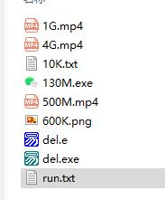

# dataclear
数据盘覆盖写入擦除程序 -基于易语言
**关于彻底销毁文件，不允许恢复，很多人会想起格式化，包括低格，但无论如何，覆盖式地写入文件和粉碎硬盘绝对是最稳妥的办法。覆盖式地写入文件即一个6GB容量的U盘，进行格式化后直接写入16GB的无效无意义文件，填满以至于元数据无法恢复。**
****
## 实现方法  
1：检查程序运行目录下 “4G.mp4”, “1G.mp4”, “500M.mp4”, “130M.exe”, “600K.png”, “10K.txt” 是否存在，这里我们为您准备了部分比较小的文件，不过一些大的文件就无法上传至github了，比如4G.mp4等，您只需要随便找个4GB左右的视频放入本目录即可，并且文件名务必改为4G.mp4.  
2：直接运行本程序，程序启动会提示让您选择要覆盖写入的U盘或者磁盘，也有可能支持目录。  
3：程序会自动覆盖写入，精度到10K以内。程序运行结束后，整个磁盘剩余空间为100K以下，内部会填充所有无意义的文件。  
****
## 要点：  
温馨提示：禁止用于干坏事。
****
## 这是效果图：  

